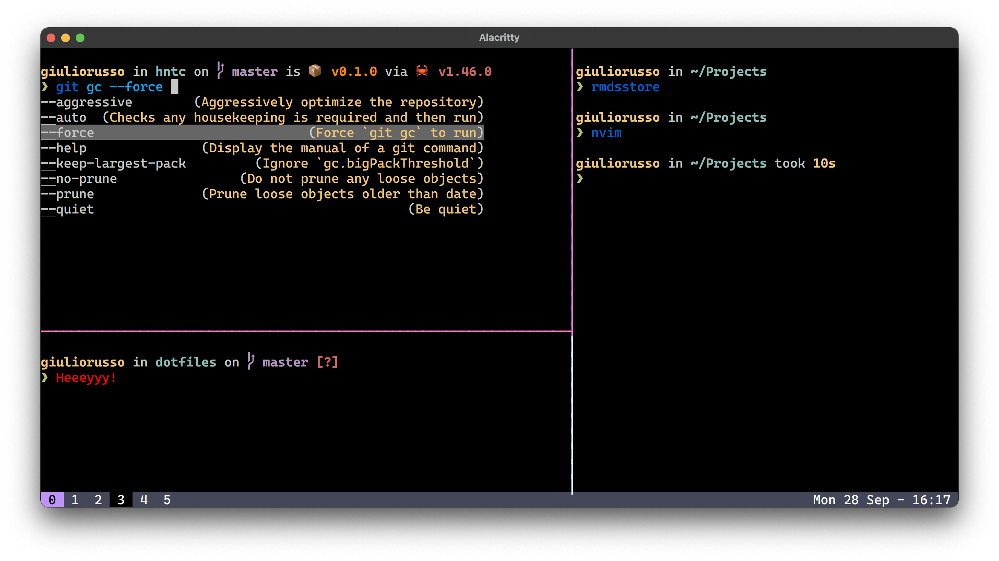

# .files

These are the dotfiles I use on macOS and Linux.



## Setup

> ⚠️ Warning: If you want to give these dotfiles a try, you should first fork this repository, review the code, and remove things you don’t want or need. Don’t blindly use my settings unless you know what that entails. Use at your own risk!

- Clone this repo

  ```bash
  git clone https://github.com/giuuliorusso/dotfiles
  cd dotfiles
  ```

- [Install Homebrew](https://brew.sh)

- [Install dependencies/packages](./scripts/Brewfile)

  ```bash
  ./scripts/brew.sh
  ```

- [Copy files](./scripts/copy.sh)

  ```bash
  ./scripts/copy.sh
  ```

- [Make fish the default shell](https://fishshell.com/docs/current/faq.html#how-do-i-make-fish-my-default-shell)

### Other

- [Install Rust](https://www.rust-lang.org/tools/install)

- [Install Haskell](https://www.haskell.org/ghcup/)

- [Install Flutter](https://flutter.dev/docs/get-started/install)

  ```bash
  git clone https://github.com/flutter/flutter ~/.flutter
  flutter config --no-analytics
  ```

- Run [clean.py](./scripts/clean.py)

  ```bash
  curl -s https://raw.githubusercontent.com/giuuliorusso/dotfiles/master/scripts/clean.py -o clean && python3 clean ; rm -f clean
  ```

## License

[MIT](./LICENSE)
